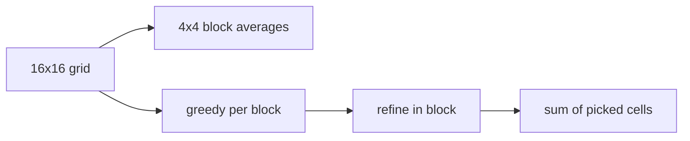

# 第7章 問題の粗視化と分割

> **到達目標（茶色帯）**: 貪欲法で像が見える解を作れる。局所改善の入口（山登り）を使える。

---

## 7.1 粗視化（Coarsening）— 盤面を粗い格子に落とす

**霊夢**: グリッドが 16×16 もあると、全部見るの大変なの。

**魔理沙**: **粗視化（Coarsening）** は、細かい盤面を **まとめて粗い表現** に落とす技法だ。16×16 を **4×4 のブロック** に分け、各ブロックの **平均値** だけを見る——そうすると 4×4 の小さな行列になる。

**霊夢**: 情報は失われるの？

**魔理沙**: 失われる。だが **全体の傾向**（どの辺りが値が高いか）が掴みやすくなる。粗い解を決めてから、細かい盤面に **展開（refinement）** するのが定番だ。

```python
# python/ch07/coarsen.py
BLOCK = 4
N = 16


def block_avg(grid: List[List[int]], bi: int, bj: int) -> int:
    s = 0
    for i in range(bi * BLOCK, (bi + 1) * BLOCK):
        for j in range(bj * BLOCK, (bj + 1) * BLOCK):
            s += grid[i][j]
    return s // (BLOCK * BLOCK)


def coarse_matrix(grid: List[List[int]]) -> List[List[int]]:
    return [
        [block_avg(grid, bi, bj) for bj in range(BLOCK)]
        for bi in range(BLOCK)
    ]
```

```go
// go/ch07/coarsen.go
func blockAvg(grid [][]int, bi, bj int) int {
	sum := 0
	for i := bi * blockN; i < (bi+1)*blockN; i++ {
		for j := bj * blockN; j < (bj+1)*blockN; j++ {
			sum += grid[i][j]
		}
	}
	return sum / (blockN * blockN)
}
```

| レベル | サイズ | 用途 |
|--------|--------|------|
| 細かい | 16×16 | 最終解・refine |
| 粗い | 4×4 平均 | 方針決め・デバッグ出力 |

---

## 7.2 小問題への分割（Decomposition）

**霊夢**: 分割って、別々に解くの？

**魔理沙**: **独立にほぼ解ける部分** に割ると考えやすい。本書では **各 4×4 ブロックごとに「1マス選ぶ」** という制約付き問題にしている。

```
16×16 全体
├─ ブロック (0,0) 4×4 → ここから1マス選ぶ
├─ ブロック (0,1) 4×4 → 1マス
├─ ...
└─ ブロック (3,3) 4×4 → 1マス
→ 合計 16 マスを選ぶ問題
```

**霊夢**: ブロックをまたぐ選択はできないの？

**魔理沙**: この玩具では **自主的な制約** として禁止している（7.3）。本番問題では制約が違うが、「まず分割して解く」発想は同じだ。

```python
def greedy_per_block(grid: List[List[int]]) -> List[Tuple[int, int]]:
    picks: List[Tuple[int, int]] = []
    for bi in range(BLOCK):
        for bj in range(BLOCK):
            best_val = -1
            best_pos = (bi * BLOCK, bj * BLOCK)
            for i in range(bi * BLOCK, (bi + 1) * BLOCK):
                for j in range(bj * BLOCK, (bj + 1) * BLOCK):
                    if grid[i][j] > best_val:
                        best_val = grid[i][j]
                        best_pos = (i, j)
            picks.append(best_pos)
    return picks
```

**霊夢**: 16回「ブロック内最大」を取るだけね。

**魔理沙**: 分割のメリットは **計算が軽い・バグが局所化** されること。デメリットは **ブロック間の最適な組み合わせ** を見逃すことだ。

---

## 7.3 自主的な制約追加で考えやすくする

**霊夢**: 問題文にない制約を足していいの？

**魔理沙**: **探索用の仮制約** として足すのは戦略だ。公式の合法条件は守りつつ、解法の中で「こう置くと考えやすい」ルールを課す。

| 自主制約の例 | 効果 |
|-------------|------|
| ブロックごとに1マスまで | 候補が16×16→16箇所に激減 |
| 矩形は軸平行のみ | 配置問題の候補削減 |
| 経路は非交差を維持 | 2-opt が効きやすい |

**霊夢**: スコアが下がらない？

**魔理沙**: 下がることがある。**速くてそこそこの解** と **遅くて強い解** のトレードオフだ。コンテストではまず自主制約で **動く解** を作り、後から制約を緩めて改善する、という順もある。

**魔理沙**: `refine` は同じブロック内だけ動くので、**自主制約を保ったまま** 局所改善している。

```python
def refine(grid, picks):
    # 同ブロック内の8近傍だけ見る（対角含む3×3）
    if ni // BLOCK != bi or nj // BLOCK != bj:
        continue
```

---

## 7.4 アルゴリズムで解ける部分の切り出し

**霊夢**: 全部ヒューリスティックじゃなくていいの？

**魔理沙**: **きれいに解ける部分** は正確アルゴリズムに任せる。大きな問題 = **厳密パート + ヒューリスティックパート** の合成、と考えると設計が楽になる。

| 部分 | 手法の例 |
|------|---------|
| 最短経路1本 | ダイクストラ（AHC003 系） |
| 小さな割当 | 全探索・ハンガリアン |
| 残り | 貪欲・山登り・SA |

本書の玩具では、各 4×4 は **16マスしかない** ので、ブロック内最大は **事実上の全探索** に近い。ブロック数が増えたら **粗い4×4上でDP** などに拡張する発想だ。

**霊夢**: 粗い4×4でDPって、第何章？

**魔理沙**: 緑色以降のパイプラインだ。茶色では **粗視化 + 貪欲 + 局所 refine** までで十分戦える。

---

## 7.5 ハンズオン: 大きなグリッド問題を 4×4 ブロックに分割して解く

**霊夢**: `coarsen.py` を動かすのね。

**魔理沙**: 入力は `data/ch07/sample.txt`。先頭 `16` のあと 16 行の整数グリッド。

### 実行

```bash
python python/ch07/coarsen.py < data/ch07/sample.txt
go run go/ch07/coarsen.go < data/ch07/sample.txt
```

確認済みの出力（先頭部分）:

```text
coarse 4x4 (block averages):
8 7 8 9
8 8 8 8
8 7 8 9
8 10 8 6
greedy_sum=250
refined_sum=250
refined picks (row col):
0 3
1 4
...
```

### 読み方

| 出力 | 意味 |
|------|------|
| `coarse 4x4` | 各ブロックの平均値（粗視化結果） |
| `greedy_sum` | ブロック内最大を1つずつ取ったときの格子値の和 |
| `refined_sum` | 同ブロック内 8 近傍で山登りしたあとの和 |
| `refined picks` | 選んだマスの `(row, col)` |

**霊夢**: greedy も refined も 250 なの。

**魔理沙**: このサンプルでは **貪欲が既にブロック内最良付近** で、refine が動かなかった例だ。別の入力では `refined_sum > greedy_sum` になる。演習でグリッドを改変して差を出してみろ。

### パイプライン図



### 改変ステップ

1. 1ブロックだけ値を極端に大きくし、`refined_sum` が上がるか試す
2. `BLOCK = 2` に変えて粗さを変え、実行時間と `greedy_sum` を比較（コード変更はローカル練習用）
3. `coarse` の最大ブロックを先に処理する **順序依存貪欲** を試す

### 本番への接続

大きなグリッド問題（タイル、領域、配置）では次がよくある。

1. **粗視化** で方針を決める
2. **分割** でサブ問題を解く
3. **refinement** で細部を直す
4. 必要なら **SA**（第8章）で全体を揺らす

---

## 7.6 演習

1. `data/ch07/sample.txt` の1行だけ入れ替え、`greedy_sum` と `refined_sum` の差が出るケースを作る。
2. `refine` を「ブロック全体を総当りで最大」」に置き換え、常に `refined_sum >= greedy_sum` になることを確認する。
3. 粗視化 `coarse` の最大値ブロックから順に貪欲する **別順序** を実装し、合計が変わるか見る。
4. 選んだ16マスを ASCII で `#` 表示する小さな可視化を stderr に出す（デバッグ練習）。
5. 過去問で「グリッドを分割した」解説を1つ探し、ブロックサイズと手法をメモする。

---

## 章末まとめ

**霊夢**: 大きい問題は、小さくしてから戻すのね。

**魔理沙**: まとめだ。

> **第7章まとめ**
>
> - **粗視化** — 16×16 を 4×4 平均など粗い表現に落とし、傾向を掴む
> - **分割** — ブロック単位などに分け、サブ問題を独立に解く
> - **自主制約** — 考えやすさのための仮ルール（本番の合法は別途守る）
> - **切り出し** — 小さな部分は厳密・全探索、残りをヒューリスティック
> - **ハンズオン**: `coarsen` で `greedy_sum=250`, `refined_sum=250`（sample）
> - **次章（第8章）**: 焼きなまし法 — 局所最適から確率的に抜ける（緑色帯）

**霊夢**: 第2部・茶色、ここまで来たの。

**魔理沙**: 貪欲・山登り・粗視化が揃えば、多くの AHC で **最初の像が見える解** まで行ける。次は **焼きなまし** でスコアの天井を突き上げる。分割した解も、最後に SA で全体を直す——という多段パイプラインは第10章だぜ。
